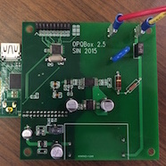
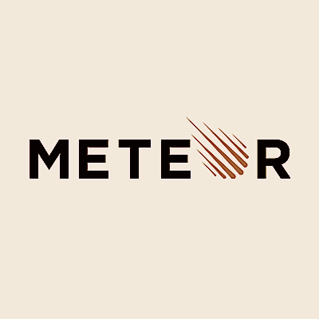

# Help us create the Internet of Things for power quality!

Interested in the Internet of Things? The Open Power Quality project is looking for undergraduates and graduate students in both computer science and electrical engineering to help us create technology that supports renewable energy in Hawaii!

## Hardware design: OPQBox2

Are you interested in hardware?  We are currently designing, fabricating, and deploying [OPQBox2](http://openpowerquality.org/opqbox2/).   You will gain experience in hardware design, integration, building a product for consumer market, DSP, and integration with web technologies. You will help with the design of our custom power quality instrument, implement power quality algorithms, learn about IEEE standards, do interdisciplinary work with ICS students, and discuss power quality concerns with HECO engineers and other stakeholders.

Example project: In order to function through a power outage, our device employs a supercapacitor circuit. At the moment, we are only able to achieve 1 second of uptime. You can help us redesign our instrument to support 30 seconds of uptime.

## Software design: Web and mobile UI development

Are you interested in web application development? We are currently designing and implementing [OPQView2](https://github.com/openpowerquality/opqview2), a [Meteor](meteor.com) application for user interaction with the data.

Meteor is a modern framework for developing "reactive" applications using Javascript and MongoDB, and with the ability to compile into native mobile applications for Android and iOS.

Example project:  Design and implement a geo-aware application that can provide users with power quality information about their immediate vicinity.

## System design: Scalability and big data

Are you interested in highly scalable systems and big data?  Come help us develop the system architecture for OPQ Version 2, including [OPQHub2](https://github.com/openpowerquality/opqhub2), a repository for power quality data.

We will also be exploring the use of [IOBeam](http://iobeam.com) as a possible back-end infrastructure.

Let us know you're interested in any or all of these projects through the [Contact](contact.html) page.
