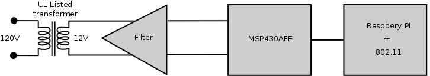
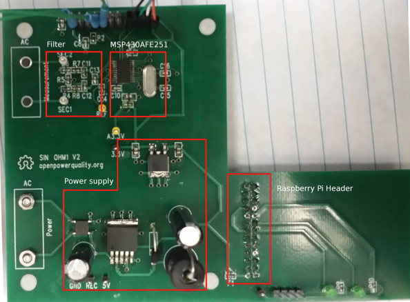
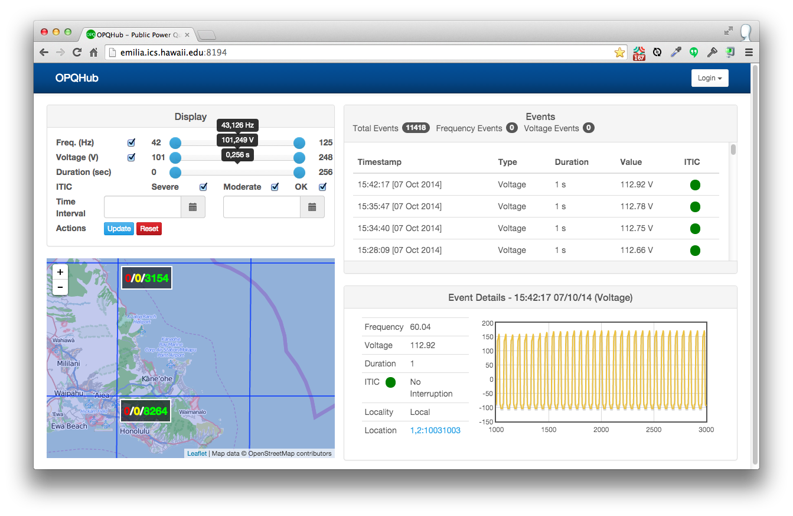

# Overview

The Pipeline (G1) pilot study began in mid-August, 2014 with the installation of three G1 OPQBoxes on Oahu. The three OPQBoxes were installed in three locations: a scientific laboratory building on the UH Manoa campus, an apartment complex in Honolulu, and a residence on the Windward side of Oahu.

Also at that time, an initial version of the OPQHub cloud service was deployed and began accepting data from the devices.

Both OPQBoxes and the OPQHub received updates during the pilot study.  OPQBox updates improved duration recording and event throttling.  The OPQHub cloud service underwent significant redesign of its user interface. These pilot study results will refer to the latest versions of hardware and software.  In addition, one OPQBox was relocated from its Windward Oahu location to a Honolulu location during the pilot study.

The goals of the Pipeline Pilot Study were:

  1. To validate communication between OPQBoxes and an OPQHub.
  2. To obtain preliminary, uncalibrated data about grid stability on Oahu.
  3. To obtain requirements for the design of the G2 OPQBox and OPQHub.

# Data summary

After approximately two months of data collection, the devices generated over 9000 voltage events (i.e. voltages outside the range of 114 - 126 V, exceeding the 5% variability for normal operation established by HECO).  The devices also generated 6 frequency events (i.e. frequency fluctuation outside the range of 57 - 63 Hz).

All of the frequency events were less than 1 second in duration.  Only the Windward Oahu OPQBox observed frequency events. The six recorded frequency events ranged from 42 Hz to 125 Hz. Some of these values appear extreme and we cannot yet rule out device error as a cause of at least some of these events. 

Voltage events ranged from an 101 V to 248 V. Most of the voltage events were on also the order of 1 second in duration, though over 20 events were longer than 60 seconds. The longest recorded voltage event was 255 seconds.  Some of these values also appear to be extreme and we cannot yet rule out device error as a cause of at least some of these events. 

# General results

First, we feel that all of the goals for this pilot study were met in general.   The OPQBoxes were able to successfully communicate with the OPQHub.  Each of the three OPQBoxes collected several thousand voltage events. Both OPQBoxes and the OPQHub appeared relatively stable.  Our results also appear to demonstrate the possibility of grid stability issues on Oahu, although we are not yet confident enough in our design to make firm conclusions.

Second, the pilot study has called into question the use of ITEC as an analytic for determining the severity of power quality events. For example, ITEC only deals with voltage and does not take into account frequency or THD.  Second, it does not take into account the possibility of "additive" impact: the possibility that several thousand "small" events could add up to a significant impact on modern electrical components.

Third, the rather extreme values generated by the G1 OPQBoxes calls into question their accuracy.  We need to determine ways to better validate the accuracy and reliability of OPQBoxes in future generations of the hardware. 

# OPQBox

## OPQBox Goals

We designed the G1 OPQBox with the following goals:

  1. Unit price below \$60 to support large-scale deployment
  2. Easy to install and safe to operate
  3. 16/24 bit resolution and 50+ samples per grid cycle
  4. Support for frequency and voltage measurement
  5. Onboard processing and local storage
  6. Inter-device synchronization via NTP
  7. Ease of extensibility
  8. Open source license and development process 
  
Here is the G1 OPQBox block diagram:

For safety, the G1 OPQBox is galvanically isolated from the power grid via a UL-listed wall plug transformer. This transformer is used both for powering the meter and monitoring the power grid. The output of the transformer's secondary windings is passed through a low-pass filter which is responsible for scaling down the voltage to the analog-to-digital converter(ADC) range, as well as filtering out frequencies above 1Mhz. In addition, this filter protects the sensitive inputs of the ADC.

The output of the filter is digitized using an ADC on an MSP430AFE microcontroller. This microcontroller is specifically designed for power metering. The G1 OPQBox combines an analog front-end, a 24bit SAR ADC capable of sampling at 4kHz, and a 16bit MCU into a single integrated circuit to reduce the bill of materials. Here is a picture of the G1 circuit board:

To enable the sensor network to scale, a significant amount of processing must be performed on the device itself. This includes power quality event detection, as well as buffering of historic data leading up to the event. Furthermore, event data needs to be uploaded to the cloud for further analysis. 

Currently, we use a Raspberry Pi single board computer for the main processing unit. The MSP430AFE sends digitized samples to the Raspberry Pi via the SPI protocol. Data is compared to the expected waveform, and if the deviation is significant, an event containing the raw data is send to the cloud via a USB 802.11 adapter. 

## OPQBox Findings

While the G1 OPQBox generally satisfied the design goals, the G1 Pilot Study revealed a number of issues:

**Impact of NTP-based synchronization on analysis.** The G1 design relies on NTP (Network Time Protocol) to synchronize the clocks of the OPQBoxes.  Most utility-grade power quality devices (such as PMUs) use GPS in order to get nanosecond-level synchronization. We chose NTP because this reduces the cost of device hardware significantly as well as simplifies installation and use. We need to perform more research to determine the level of synchronization we are obtained between OPQBoxes, and what impact the use of NTP has on the kinds of analyses we can support.

**Event recording upon power cutout.** Our current hardware has no battery backup, which means in the event of a complete loss of power, the device will not have time to shut down and record the wave form prior to cut-off.   We will rectify this design shortcoming in the G2 design.

*(Sergey, please send me an email with other issues regarding the G1 design. For example, the use of a transformer to both power the device and collect data.)*

# OPQHub

## OPQHub Goals

We designed the G1 OPQHub with the following goals:

  1. Receive and store events from OPQBoxes.
  2. Support basic configuration by users.
  3. Provide a useful public interface for viewing events. 
  3. Provide map-based location "coarsening" for privacy 
  4. Provide very basic alert-based analytics to inform users when events occur. 
  5. Implement the ITEC algorithm for determining event impact.
  
The G1 OPQHub is a two-tier web application using the [Play Framework](https://www.playframework.com/) and [MySQL](http://www.mysql.com/).  It is deployed on a virtual server (2 Intel Xeon X5690 CPUs at 3.47GHz, 32 GB RAM, 100 GB solid state disk) at the University of Hawaii. 

Here is a screen image of the OPQHub home page as of the end of the G1 Pilot Study period:

This page illustrates the many of the basic features of the G1 service: display of event data, map-based viewing of events, and ITEC characterization. 

*(Philip will add more screen shots soon.)*

## OPQHub Findings

While the G1 OPQHub also satisfied the design goals at a high level, the G1 Pilot Study revealed a number of issues:

**Usability.** The G1 Pilot Study revealed that the design of a highly usable public interface is a non-trivial undertaking.  The home page UI was completely redesigned at the start of the pilot study, and it continues to undergo significant evolution.  At the conclusion of the G1 Pilot Study, the design is not yet stable enough to support a usability study using naive users. 

**Performance.** The performance of the system was found to be satisfactory, however we do not expect the current architecture to scale beyond at most a few thousand OPQBoxes. 

*(Anthony, please send me an email with any other shortcomings regarding the G1 OPQHub design. For example, the use of a transformer to both power the device and collect data.)*

# Communication Protocol

Our first generation system also includes the design and implementation of the [OPQ Communication Protocol](https://github.com/openpowerquality/opq/wiki/OPQ-Communication-Protocol) for data transmission to reduce the bandwidth required. 

The device and cloud service communicate using server-side events (SSE) over HTTP, which enables the device to be sent commands from the cloud even though it might be located behind the firewall of a home wireless router.

Our findings from the G1 Pilot study were:

*(Sergey and Anthony: Please send me some notes on what is good and what needs work in the communication protocol.)*

